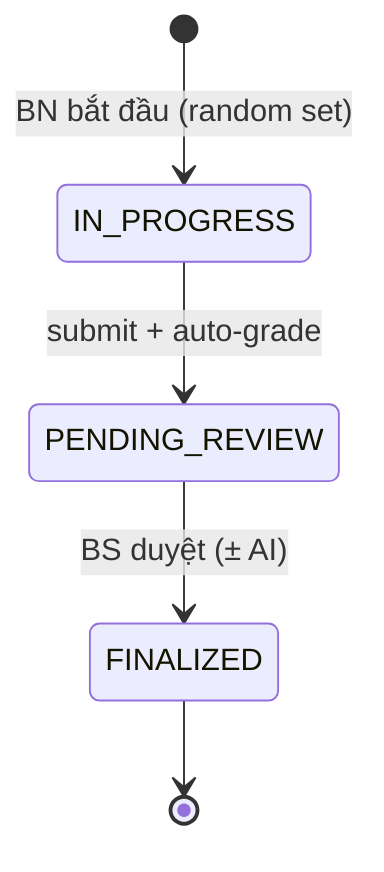

# MoCA Platform — Entity & database design

**Version:** 1.1  
**Stack:** PostgreSQL 16 → Flyway → Spring JPA → React Query  
**Source of truth (SQL):** `backend/src/main/resources/db/migration/`

---

## Table of contents

1. [Design principle — 3 aggregates](#1-design-principle--3-aggregates)
2. [Implementation status](#2-implementation-status)
3. [ER diagram](#3-er-diagram)
4. [PostgreSQL enums](#4-postgresql-enums)
5. [Table specs](#5-table-specs)
6. [`raw_answers` contract](#6-raw_answers-contract)
7. [Object storage (MinIO)](#7-object-storage-minio)
8. [Test session lifecycle](#8-test-session-lifecycle)
9. [Section scoring map](#9-section-scoring-map)
10. [Java package map](#10-java-package-map)
11. [API ↔ entity](#11-api--entity)
12. [Migration plan](#12-migration-plan)
13. [What we deliberately skip](#13-what-we-deliberately-skip)
14. [Implementation order](#14-implementation-order)

---

## 1. Design principle — 3 aggregates

Tách theo **lifecycle**, không theo từng ô trên form.

| Aggregate | Entity Java | Bảng | Trả lời câu hỏi |
|-----------|-------------|------|-----------------|
| **Who** | `UserEntity` (+ profile extensions) | `users`, `doctor_profiles`, `patient_assignments`, `appointments` | Ai là BN/BS/Admin? |
| **What (đề)** | `MocaSetEntity` | `moca_sets` | Đề thi gồm nội dung gì? |
| **Attempt (bài làm)** | `TestSessionEntity` + `TestSectionScoreEntity` | `test_sessions`, `test_section_scores` | BN làm đề nào, trả lời gì, điểm bao nhiêu? |

**Không có** `QuestionEntity` từng câu — MoCA có 9 phần với logic chấm khác nhau.

```text
MocaSet (đề in sẵn)     TestSession (bài làm)      User (người)
      │                        │                        │
      └──── set_id FK ─────────┘──── patient_id FK ─────┘
```

**Quy tắc DuyLong:** `@Transactional` trên Service, Controller mỏng.

---

## 2. Implementation status

| Artifact | Status | Notes |
|----------|--------|-------|
| `V1__initial_schema.sql` | ✅ shipped | 7 tables + 4 enums |
| `UserEntity` | ✅ | |
| `TestSessionEntity` | ✅ | partial fields mapped |
| `TestSessionService.submit` | ✅ | saves session, offloads drawings |
| `DrawingAnswerService` | ✅ | Section 1 PNG → MinIO |
| `ObjectStorageService` | ✅ | MinIO put/get/presign |
| `moca_sets` table | ❌ V2 | `set_id` is free string today |
| `MocaSetEntity` | ❌ | frontend still uses `QUESTION_BANK` |
| `TestSectionScoreEntity` | ❌ | grading still in React |
| `GradingService` | ❌ | port `gradeTest()` from frontend |
| Audio offload | ❌ V3 | blob URLs stored as-is |
| `DoctorProfileEntity` etc. | ❌ | tables exist, no Java yet |

---

## 3. ER diagram

```mermaid
erDiagram
  users ||--o| doctor_profiles : "role=DOCTOR"
  users ||--o{ patient_assignments : "patient"
  users ||--o{ patient_assignments : "doctor"
  users ||--o{ appointments : "patient"
  users ||--o{ appointments : "doctor"
  moca_sets ||--o{ test_sessions : "set_id"
  users ||--o{ test_sessions : "patient"
  users ||--o{ test_sessions : "assigned_doctor"
  users ||--o{ test_sessions : "reviewed_by"
  test_sessions ||--|{ test_section_scores : "session_id"

  users {
    uuid id PK
    user_role role
    varchar email UK
    varchar full_name
    int education_years
  }

  doctor_profiles {
    uuid user_id PK_FK
    varchar specialty
    boolean is_active
  }

  patient_assignments {
    uuid id PK
    uuid patient_id FK
    uuid doctor_id FK
    boolean is_current
  }

  appointments {
    uuid id PK
    timestamptz scheduled_at
    appointment_status status
  }

  moca_sets {
    varchar id PK
    varchar label
    jsonb content
    boolean is_active
  }

  test_sessions {
    uuid id PK
    varchar set_id FK
    jsonb raw_answers
    test_session_status status
    int auto_score
    int final_score
  }

  test_section_scores {
    uuid id PK
    varchar section_key
    int max_points
    int points
    scoring_mode scoring_mode
    jsonb ai_suggestion
  }
```

---

## 4. PostgreSQL enums

Defined in `V1__initial_schema.sql`:

| Enum | Values |
|------|--------|
| `user_role` | `PATIENT`, `DOCTOR`, `ADMIN` |
| `test_session_status` | `IN_PROGRESS`, `PENDING_REVIEW`, `FINALIZED` |
| `appointment_status` | `SCHEDULED`, `COMPLETED`, `CANCELLED` |
| `scoring_mode` | `AUTO`, `REVIEW` |

Hibernate maps these with `@JdbcTypeCode(SqlTypes.NAMED_ENUM)` + `columnDefinition`.

---

## 5. Table specs

### 5.1 `users`

| Column | Type | Notes |
|--------|------|-------|
| `id` | UUID PK | `gen_random_uuid()` |
| `email` | VARCHAR(255) UNIQUE | login |
| `password_hash` | VARCHAR(255) | bcrypt |
| `role` | `user_role` | PATIENT, DOCTOR, ADMIN |
| `full_name` | VARCHAR(255) | |
| `education_years` | INT | BN — hiệu chỉnh +1 nếu ≤ 12 |
| `gender` | VARCHAR(20) | optional |
| `date_of_birth` | DATE | optional |
| `created_at`, `updated_at` | TIMESTAMPTZ | |

**Index:** `idx_users_role ON (role)`

**Java:** `UserEntity` ✅

---

### 5.2 `doctor_profiles`

| Column | Type | Notes |
|--------|------|-------|
| `user_id` | UUID PK FK → users | 1:1 với user role DOCTOR |
| `specialty` | VARCHAR(255) | |
| `license_number` | VARCHAR(100) | |
| `is_active` | BOOLEAN DEFAULT true | admin tắt BS |

**Java:** `DoctorProfileEntity` — slice tiếp

---

### 5.3 `patient_assignments`

| Column | Type | Notes |
|--------|------|-------|
| `id` | UUID PK | |
| `patient_id` | UUID FK → users | |
| `doctor_id` | UUID FK → users | |
| `is_current` | BOOLEAN DEFAULT true | |
| `assigned_at` | TIMESTAMPTZ | lịch sử đổi BS |

**Indexes:**
- `idx_patient_assignments_current` — partial unique: 1 current doctor per patient
- `idx_patient_assignments_doctor ON (doctor_id)`

**Java:** `PatientAssignmentEntity` — slice tiếp

---

### 5.4 `appointments`

| Column | Type | Notes |
|--------|------|-------|
| `id` | UUID PK | |
| `patient_id` | UUID FK → users | |
| `doctor_id` | UUID FK → users | |
| `scheduled_at` | TIMESTAMPTZ | |
| `status` | `appointment_status` | SCHEDULED, COMPLETED, CANCELLED |
| `notes` | TEXT | optional |
| `created_at` | TIMESTAMPTZ | |

**Indexes:**
- `idx_appointments_patient ON (patient_id, scheduled_at)`
- `idx_appointments_doctor ON (doctor_id, scheduled_at)`

**Java:** `AppointmentEntity` — slice tiếp

---

### 5.5 `moca_sets` — V2 migration

Đề thi = **một document JSON**, không normalize từng câu.

| Column | Type | Notes |
|--------|------|-------|
| `id` | VARCHAR(50) PK | e.g. `MOCA_SET_1` |
| `label` | VARCHAR(255) | clinician only — never shown to patient |
| `source` | VARCHAR(255) | e.g. `vietnamesemoca_1.pdf` |
| `content` | JSONB NOT NULL | mirror `QUESTION_BANK` entry |
| `is_active` | BOOLEAN DEFAULT true | admin bật/tắt đề |
| `created_at` | TIMESTAMPTZ | |

**`content` JSON shape** (from `MocaTestContainer` `QUESTION_BANK`):

```json
{
  "naming": [
    { "id": "n1", "emoji": "🦁", "answer": "Sư tử", "accept": ["su tu", "lion"] }
  ],
  "memory_words": [
    { "word": "Vẻ mặt", "cue": "Đây là một bộ phận trên cơ thể" }
  ],
  "sentences": [
    "Tôi chỉ biết rằng Nam là người cần được giúp đỡ hôm nay"
  ],
  "fluency": { "letter": "L", "threshold": 11 },
  "abstraction": {
    "example": { "pair": "Quả chuối – Quả cam", "answer": "Hoa quả (trái cây)" },
    "pairs": [
      { "pair": "Tàu – Xe đạp", "accept": ["phuong tien", "giao thong"] }
    ]
  }
}
```

**Phần cố định mọi đề** (digit spans, letter-A stream, serial 7s, orientation) — giữ trong backend `AttentionConstants` hoặc `content.fixed_sections`; không đổi theo set.

**Java:** `MocaSetEntity` — slice tiếp

**API (planned):**
- `GET /api/moca-sets/active` — random 1 đề active (BN bắt đầu test)
- `GET /api/moca-sets/{id}` — BS xem đề khi chấm

---

### 5.6 `test_sessions`

| Column | Type | Notes |
|--------|------|-------|
| `id` | UUID PK | |
| `patient_id` | UUID FK → users NOT NULL | |
| `doctor_id` | UUID FK → users | BS được gán lúc submit |
| `set_id` | VARCHAR(50) NOT NULL | FK → `moca_sets` (V2) |
| `raw_answers` | JSONB NOT NULL DEFAULT `{}` | toàn bộ câu trả lời BN |
| `status` | `test_session_status` | IN_PROGRESS → PENDING_REVIEW → FINALIZED |
| `auto_score` | INT | phần chấm tự động |
| `review_score` | INT | phần BS chấm (vẽ + audio) |
| `final_score` | INT | auto + review + education_bonus |
| `education_bonus` | INT DEFAULT 0 | 0 hoặc 1 |
| `classification` | VARCHAR(100) | bình thường / MCI / sa sút |
| `submitted_at` | TIMESTAMPTZ | |
| `reviewed_at` | TIMESTAMPTZ | |
| `reviewed_by` | UUID FK → users | |
| `created_at` | TIMESTAMPTZ | |

**Indexes:**
- `idx_test_sessions_patient ON (patient_id, created_at DESC)`
- `idx_test_sessions_doctor_review ON (doctor_id, status) WHERE status = 'PENDING_REVIEW'`

**Java:** `TestSessionEntity` ✅ — bổ sung FK relation tới `MocaSetEntity`, `review_score`, `education_bonus`

**Today:** submit jumps straight to `PENDING_REVIEW` (no `IN_PROGRESS` row yet).

---

### 5.7 `test_section_scores`

Một row = **một phần MoCA** (không phải một câu).

| Column | Type | Notes |
|--------|------|-------|
| `id` | UUID PK | |
| `session_id` | UUID FK → test_sessions | ON DELETE CASCADE |
| `section_key` | VARCHAR(50) | `section_1` … `section_9` |
| `label` | VARCHAR(255) | Vietnamese label |
| `max_points` | INT | |
| `points` | INT DEFAULT 0 | |
| `scoring_mode` | `scoring_mode` | AUTO or REVIEW |
| `ai_suggestion` | JSONB | `{ "points": 3, "reason": "..." }` |
| `doctor_override` | INT | BS sửa điểm |

**Constraint:** `UNIQUE (session_id, section_key)`

**Index:** `idx_test_section_scores_session ON (session_id)`

**Java:** `TestSectionScoreEntity` — slice tiếp

---

## 6. `raw_answers` contract

Khớp keys từ `frontend/src/features/patient/MocaTestContainer.jsx` — **không** tách bảng `answers`.

### 6.1 Wire format (frontend → API on submit)

```json
{
  "section_1a_trail_canvas": "data:image/png;base64,...",
  "section_1b_cube_canvas": "data:image/png;base64,...",
  "section_1c_clock_canvas": "data:image/png;base64,...",
  "section_2_naming": {
    "n1": { "text": "Sư tử", "mode": "text" }
  },
  "section_3_audio_v1": "blob:http://localhost/...",
  "section_3_audio_v2": "blob:http://localhost/...",
  "section_4a_forward": "21854",
  "section_4a_backward": "247",
  "section_4b": { "errors": 0, "omissions": 0, "falseAlarms": 0, "score": 1 },
  "section_4c": ["93", "86", "79", "72", "65"],
  "section_5": { "0": "blob:...", "1": "blob:..." },
  "section_6": { "letter": "L", "count": 12, "score": 1 },
  "section_6_text": "lá lửa lê lốc ...",
  "section_6_recording": "blob:...",
  "section_7": {
    "0": { "pair": "Tàu – Xe đạp", "text": "phương tiện" }
  },
  "section_8_inputs": {
    "word_1": { "text": "Vẻ mặt", "used_cue": false }
  },
  "section_9": {
    "date": "24", "month": "6", "year": "2026",
    "day": "Thứ Ba", "place": "Phòng khám", "city": "Hà Nội"
  }
}
```

### 6.2 Stored format (after backend offload)

Drawing keys are replaced with MinIO object refs (see §7). Text and numeric fields stay inline in JSONB.

| Key | MoCA section | Stored as |
|-----|--------------|-----------|
| `section_1a_trail_canvas` | 1 — trail | MinIO ref ✅ |
| `section_1b_cube_canvas` | 1 — cube | MinIO ref ✅ |
| `section_1c_clock_canvas` | 1 — clock | MinIO ref ✅ |
| `section_2_naming` | 2 — naming | inline JSON |
| `section_3_audio_v1` | 3 — memory encoding | blob URL (→ MinIO V3) |
| `section_3_audio_v2` | 3 — memory encoding | blob URL (→ MinIO V3) |
| `section_4a_forward` | 4 — digit span | string |
| `section_4a_backward` | 4 — digit span | string |
| `section_4b` | 4 — letter A | object with score |
| `section_4c` | 4 — serial 7s | string array |
| `section_5` | 5 — sentence repeat | blob URLs (→ MinIO V3) |
| `section_6` | 6 — fluency score | inline object |
| `section_6_text` | 6 — fluency words | string |
| `section_6_recording` | 6 — optional audio | blob URL (→ MinIO V3) |
| `section_7` | 7 — abstraction | inline object |
| `section_8_inputs` | 8 — delayed recall | inline object |
| `section_9` | 9 — orientation | inline object |

---

## 7. Object storage (MinIO)

Large binary answers (canvas PNG, audio webm) must **not** live in Postgres JSONB long-term. Pattern: upload on submit, store a small ref object in `raw_answers`.

### 7.1 Infrastructure

| Setting | Team server |
|---------|-------------|
| Postgres | `192.168.22.24`, database **`moca-test-db`** (pgAdmin: `/browser/`) |
| MinIO API | separate host — `MINIO_ENDPOINT` (S3, not pgAdmin) |
| MinIO bucket | `moca-drawings` (`application.yml` → `minio.bucket`) |
| Object key pattern | `sessions/{sessionId}/{answerKey}.{ext}` |

### 7.2 Stored ref shape

After `DrawingAnswerService.offloadDrawings()`:

```json
{
  "storage": "minio",
  "bucket": "moca-drawings",
  "objectKey": "sessions/550e8400-e29b-41d4-a716-446655440000/section_1a_trail_canvas.png",
  "contentType": "image/png"
}
```

### 7.3 Keys offloaded today

Defined in `DrawingAnswerKeys.CANVAS_KEYS`:

- `section_1a_trail_canvas`
- `section_1b_cube_canvas`
- `section_1c_clock_canvas`

### 7.4 Keys to offload (V3)

Planned — same ref shape, `contentType: "audio/webm"`:

- `section_3_audio_v1`, `section_3_audio_v2`
- `section_5` (nested blob URLs per sentence index)
- `section_6_recording`

### 7.5 Retrieval API

| Endpoint | Purpose |
|----------|---------|
| `GET /api/test-sessions/{sessionId}/drawings/{answerKey}` | ✅ returns PNG bytes |

Planned: `GET .../audio/{answerKey}` or presigned MinIO URLs for doctor playback.

### 7.6 Why no `media_files` table?

Refs inside `raw_answers` keep each session self-contained. Add a separate table only if you need cross-session search, orphan cleanup jobs, or shared assets.

---

## 8. Test session lifecycle



| Step | DB writes |
|------|-----------|
| **Start** | INSERT `test_sessions` status `IN_PROGRESS`, assign `set_id` |
| **Submit** | UPDATE `raw_answers`, offload media, run `GradingService`, INSERT 9 `test_section_scores`, set `auto_score`, status → `PENDING_REVIEW` |
| **Review** | UPDATE REVIEW sections (`section_1`, `section_5`), compute `final_score` + `education_bonus`, status → `FINALIZED` |

**Scoring formula:**

```text
final_score = auto_score + review_score + education_bonus
education_bonus = 1 if patient.education_years <= 12 else 0
```

---

## 9. Section scoring map

| `section_key` | Label (VI) | max | `scoring_mode` | Graded by |
|---------------|------------|-----|----------------|-----------|
| `section_1` | Thị giác – không gian | 5 | REVIEW | Doctor (drawings) |
| `section_2` | Gọi tên con vật | 3 | AUTO | Text match vs `moca_sets.content.naming` |
| `section_3` | Trí nhớ (ghi nhận) | 0 | AUTO | Encoding only — no points |
| `section_4` | Sự chú ý | 6 | AUTO | Digits, letter-A, serial 7s |
| `section_5` | Nhắc lại câu | 2 | REVIEW | Doctor (audio) |
| `section_6` | Sự lưu loát | 1 | AUTO | Word count vs threshold |
| `section_7` | Tư duy trừu tượng | 2 | AUTO | Text match vs `abstraction.pairs` |
| `section_8` | Nhớ lại có trì hoãn | 5 | AUTO | vs `memory_words` |
| `section_9` | Định hướng | 6 | AUTO | Date/place fields |

`ai_suggestion` on REVIEW sections assists the doctor; `doctor_override` wins when set.

---

## 10. Java package map

```text
com.moca.platform.DataLayer.protocol/
├── UserEntity              ✅
├── UserRole                ✅
├── DoctorProfileEntity
├── PatientAssignmentEntity
├── AppointmentEntity
├── MocaSetEntity
├── TestSessionEntity       ✅
├── TestSessionStatus       ✅
├── TestSectionScoreEntity
├── ScoringMode             ✅
└── *Repository             (JpaRepository per entity)

com.moca.platform.ObjectDb/
├── ObjectStorageService    ✅
├── DrawingAnswerKeys       ✅
├── MinioConfig             ✅
└── MinioProperties         ✅

com.moca.platform/
├── DrawingAnswerService    ✅
├── TestSessionService      ✅ (submit + load drawing)
├── MocaSetService          — load đề, random active set
├── GradingService          — port gradeTest() từ React
└── *Controller
```

---

## 11. API ↔ entity

| Endpoint | Status | Entity / storage |
|----------|--------|------------------|
| `POST /api/test-sessions` | ✅ | INSERT `test_sessions`, offload drawings |
| `GET /api/test-sessions/{id}/drawings/{key}` | ✅ | MinIO via ref in `raw_answers` |
| `GET /api/patient/sessions` | planned | `test_sessions WHERE patient_id = ?` |
| `GET /api/doctor/reviews` | planned | `status = PENDING_REVIEW` |
| `PATCH /api/doctor/reviews/{id}` | planned | UPDATE section scores + FINALIZED |
| `GET /api/moca-sets/active` | planned | random row `WHERE is_active` |
| `GET /api/moca-sets/{id}` | planned | PK lookup |
| `GET /api/patient/appointments` | planned | `appointments` by patient |
| `POST /api/patient/change-doctor` | planned | flip `patient_assignments.is_current` |

**Submit request body** (`SubmitTestSessionRequest`):

```json
{
  "patientId": "uuid",
  "setId": "MOCA_SET_1",
  "rawAnswers": { "...": "see §6" }
}
```

---

## 12. Migration plan

| File | Content |
|------|---------|
| `V1__initial_schema.sql` ✅ | enums, users, profiles, assignments, appointments, test_sessions, test_section_scores |
| `V2__moca_sets.sql` | `CREATE TABLE moca_sets`, seed `MOCA_SET_1`, `ALTER test_sessions ADD FK (set_id)` |
| `V3__audio_offload.sql` | optional schema change only if needed; logic in `MediaAnswerService` |

**V2 sketch:**

```sql
CREATE TABLE moca_sets (
    id          VARCHAR(50) PRIMARY KEY,
    label       VARCHAR(255) NOT NULL,
    source      VARCHAR(255),
    content     JSONB NOT NULL,
    is_active   BOOLEAN NOT NULL DEFAULT true,
    created_at  TIMESTAMPTZ NOT NULL DEFAULT now()
);

-- INSERT seed from QUESTION_BANK.MOCA_SET_1

ALTER TABLE test_sessions
    ADD CONSTRAINT fk_test_sessions_set
    FOREIGN KEY (set_id) REFERENCES moca_sets (id);
```

Flyway + `hibernate.ddl-auto: validate` — schema changes **only** via migration files.

---

## 13. What we deliberately skip

| Idea | Why skip |
|------|----------|
| `questions` table | 9 sections ≠ uniform Q&A |
| `answers` table per field | JSONB đủ; normalize when search needed |
| `TestEntity` separate from session | Session **is** the test attempt |
| Duplicate question content per session | `set_id` + immutable `moca_sets.content` |
| ORM `@OneToMany` eager on `raw_answers` | JSONB blob — load lazily / stream media separately |

---

## 14. Implementation order

1. **V2 migration** — `moca_sets` + seed + FK
2. **MocaSetEntity** + `GET /api/moca-sets/active` (frontend drops hardcoded `QUESTION_BANK`)
3. **TestSectionScoreEntity** + **GradingService** (port `gradeTest()` from React)
4. **TestSessionService** — insert section scores on submit
5. **Doctor review** — PATCH section scores → FINALIZED
6. **MediaAnswerService** — audio offload (sections 3, 5, 6)
7. Remaining entities: DoctorProfile, Appointment, PatientAssignment

---

## Related docs

- UI screens & routes: [`design.md`](../design.md)
- Frontend data layer: [`frontend-architecture.md`](frontend-architecture.md)
- Local infra: [`docker-compose.yml`](../docker-compose.yml)

---

## Learn log

| Date | Change |
|------|--------|
| 2026-06-24 | v1.0 — 3 aggregates; no per-question rows |
| 2026-06-24 | v1.1 — implementation status, MinIO refs, full `raw_answers` keys, API status, V2/V3 plan |
